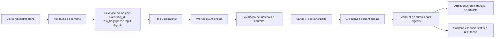
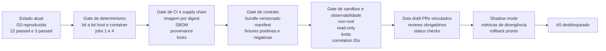

# Recomendações executivas para os próximos passos do quant-engine

## Resumo executivo

Com base no reporte consolidado — worktrees separados para isolamento do worker e boundary contratual no backend, G0 reproduzida com hashes exatos, `22 passed` no worker, `3 passed` no backend, execução em container local com `jobs=1` e `jobs=4` mantendo o mesmo `run_fingerprint`, e microgrid v03 aprovado em seis configurações no runner Python — a decisão mais adequada, como chefe de engenharia, é tratar o estado atual como **pronto para endurecimento técnico e preparação de integração**, mas **ainda não pronto para A5, ativação de runtime ou rollout funcional**. O caminho agora não é “adicionar features”; é **fechar determinismo, supply chain, contratos, sandbox, proveniência e governança de merge**. A interpretação central é a seguinte: a evidência atual é forte para equivalência funcional inicial, porém ainda insuficiente para afirmar repetibilidade operacional completa, porque SLSA define reprodutibilidade como repetição com saídas **bit a bit idênticas**, e o fato de dois cenários terem o mesmo `run_fingerprint` é um ótimo sinal, mas não substitui comparação completa de outputs, manifests e artefatos produzidos. citeturn5search3turn3search7turn3search21

A recomendação executiva de alto nível é organizar os próximos passos em seis frentes, executadas em paralelo controlado: **gates técnicos de determinismo**, **CI/CD e cadeia de suprimentos**, **bundle contratual versionado**, **hardening do sandbox**, **observabilidade e proveniência padronizadas**, e **rollout em shadow mode com A5 explicitamente bloqueado**. Para a cadeia de suprimentos, o alvo deve ser imagem por digest, não por tag, porque Docker documenta que digest é imutável enquanto tags são mutáveis; para o build, SBOM e provenance devem ser publicados juntos, pois SBOM descreve o conteúdo do artefato e provenance descreve como ele foi construído. Para Python, instalações repetíveis devem usar bloqueio de dependências com hash-checking, algo que o `pip` suporta oficialmente via `--require-hashes`. citeturn4search2turn4search16turn9search7turn0search6turn1search0turn1search8

A implicação prática é clara: o programa de trabalho deve culminar em dois draft PRs vinculados, protegidos por checks obrigatórios, com ordem de merge explícita, e depois em uma fase de shadow mode onde o backend continua fora da responsabilidade de execução do container e passa apenas a orquestrar envelopes de trabalho, correlação e coleta de manifests. Branch protection com reviews obrigatórios e status checks obrigatórios é suportado de forma nativa nas políticas de repositório do GitHub, e SLSA recomenda revisão por duas pessoas em branches protegidas para reduzir risco de mudança unilateral. citeturn8search4turn8search10turn8search15turn8search5turn8search12

## Direção arquitetural recomendada

A direção mais segura é **preservar a separação já iniciada**: o backend deve continuar como **control plane** e o quant-engine isolado como **execution plane**. O backend deve criar envelopes de job, validar contrato, registrar ids e digests, publicar a solicitação para um worker/dispatcher, e depois consumir apenas o manifest de saída validado; ele **não deve** passar a chamar diretamente o container em produção como próximo passo. Isso mantém a fronteira técnica coerente com o boundary contratual já introduzido no backend e reduz o risco de acoplamento operacional prematuro.



Essa arquitetura conversa bem com boas práticas formais de proveniência: a distribuição de provenance deve manter relação explícita entre artefatos e sua atestação; além disso, a autenticidade dessa atestação precisa ser verificável. Em termos de observabilidade, o backend e o worker devem compartilhar contexto de correlação compatível com os padrões W3C Trace Context e OpenTelemetry, que existem exatamente para associar logs, spans e requisições distribuídas. citeturn3search21turn3search11turn3search0turn3search17

A recomendação operacional resumida para a arquitetura é a seguinte:

| Recomendação | Objetivo | Passos concretos | Critério de sucesso | Responsáveis sugeridos | Esforço |
|---|---|---|---|---|---|
| Manter backend como orquestrador e worker como executor | Evitar acoplamento indevido entre API/control plane e runtime de cálculo | Não criar endpoint que execute container; backend emite envelope e consome manifest; worker valida e executa | Nenhuma chamada direta a `docker run` ou equivalente no backend principal; apenas boundary, schemas e leitura de manifests | Eng. Backend, Eng. Plataforma | Médio |
| Definir envelope canônico do job | Fixar identidade operacional e identidade semântica | Modelar `execution_id`, `attempt_id`, `run_fingerprint`, `contract_version`, `input_bundle_sha256`, `image_digest`, `correlation_id` | Todo job executado produz envelope persistível e comparável | Eng. Backend, Eng. Worker | Baixo |
| Tornar outputs consumíveis por manifest | Evitar leitura implícita de diretórios e reduzir ambiguidade | Worker sempre produz `manifest.json` com arquivos, digests, tamanhos, status e erro classificado | Backend consegue validar e ingerir sem inspeção ad hoc do filesystem | Eng. Worker, QA | Médio |

Um formato mínimo de envelope e manifest pode seguir este esqueleto:

```json
{
  "execution_id": "uuid-v7",
  "attempt_id": 1,
  "correlation_id": "trace-or-business-id",
  "run_fingerprint": "sha256:...",
  "contract_version": "1.0.0",
  "input_bundle_sha256": "sha256:...",
  "engine_image_digest": "sha256:...",
  "requested_jobs": 4,
  "outputs_manifest": {
    "artifacts": [
      {"path": "runtime.json", "sha256": "sha256:...", "bytes": 12345},
      {"path": "metrics.json", "sha256": "sha256:...", "bytes": 4567}
    ],
    "status": "succeeded"
  }
}
```

## Gates técnicos de determinismo e repetibilidade

O primeiro gate decisivo é sair de “evidência forte” para “determinismo demonstrado”. A referência correta aqui é a definição de build reprodutível adotada pelo ecossistema SLSA: repetir com os mesmos inputs deve gerar saída **bit a bit idêntica**. Em paralelo, a documentação do `pytest` alerta que testes que falham ou variam quando executados em paralelo frequentemente indicam dependência de ordering ou estado de sistema não controlado; por isso, a matriz de testes precisa incluir host e container, paralelismo e repetição. citeturn5search3turn1search2

A recomendação objetiva é transformar a validação atual em uma **matriz de repetibilidade** e não apenas em um conjunto de execuções pontuais.

| Gate técnico | Objetivo | Passos concretos | Critério de sucesso mensurável | Responsáveis sugeridos | Esforço |
|---|---|---|---|---|---|
| Comparação bit a bit de outputs entre `jobs=1` e `jobs=4` | Provar que paralelismo não altera o resultado final | Executar o mesmo caso com `jobs=1` e `jobs=4`; gerar `manifest.json`; comparar lista de arquivos, digests, bytes e conteúdo canônico | `mismatch_count=0`, `missing=0`, `unexpected=0`, `artifact_count` idêntico, todos os SHA-256 idênticos em pelo menos 10 repetições por caso | Eng. Worker, QA | Médio |
| Matriz host versus container | Provar que isolamento via container não altera a semântica do output | Rodar G0 e as 6 configs microgrid v03 em host Python e no container, com os mesmos insumos | 100% dos manifests equivalentes entre host e container; sem divergência de bytes nos artefatos canônicos | Eng. Worker, Eng. Plataforma | Médio |
| Repetição multi-run | Detectar nondeterminismo escondido | Rodar cada caso crítico repetidamente com cache frio e cache quente | Zero divergências em N execuções consecutivas, com N mínimo recomendado de 10 para smoke e 30 para nightly | QA, Eng. Worker | Baixo |
| Injeção de falhas de input | Validar fail-fast, classificação de erro e não produção parcial indevida | Testar input ausente, digest incorreto, arquivo truncado, diretório inesperado, artefato duplicado, path traversal e symlink | Erro classificado corretamente; nenhum output “sucesso” é emitido; manifest registra falha e causa | QA, Segurança de Aplicação | Médio |
| Teste de ordem e seeds | Detectar dependência de ordenação, timestamps ou aleatoriedade | Embaralhar ordem de inputs; fixar e variar seed; fixar `SOURCE_DATE_EPOCH` quando aplicável | Mesmo `run_fingerprint` e mesmos digests quando a semântica é a mesma; fingerprint diferente quando a entrada muda semanticamente | Eng. Worker | Médio |
| Comparador fechado | Impedir falso positivo por comparação parcial | Comparador deve verificar expected/actual/missing/unexpected, não só hashes comparados | Nenhum cenário de lista vazia ou parcial passa como “0 mismatches” | QA, Eng. Worker | Baixo |

Uma matriz recomendada de execução é esta:

| Caso | Host Python | Container | `jobs=1` | `jobs=4` | Repetição | Comparação exigida |
|---|---:|---:|---:|---:|---:|---|
| Golden G0 | Sim | Sim | Sim | Sim | 10x | Bit a bit + manifest completo |
| Microgrid v03 config 1 a 6 | Sim | Sim | Sim | Sim | 10x | Bit a bit + manifest completo |
| Input ausente/corrompido | Sim | Sim | Sim | Sim | 3x | Falha classificada, sem outputs válidos |
| Ordem embaralhada de inputs | Sim | Sim | Sim | Sim | 5x | Mesmo resultado quando semântica igual |
| Stress de concorrência | Opcional | Sim | Não | Sim | 20x nightly | Sem divergência nem arquivo faltante |

Um pequeno pseudocódigo de comparador deve ser tratado como artefato de engenharia obrigatório:

```python
def compare_manifests(expected, actual):
    assert expected["status"] == actual["status"]
    exp = {a["path"]: a for a in expected["artifacts"]}
    act = {a["path"]: a for a in actual["artifacts"]}

    missing = sorted(set(exp) - set(act))
    unexpected = sorted(set(act) - set(exp))
    mismatched = []

    for path in sorted(set(exp) & set(act)):
        if exp[path]["sha256"] != act[path]["sha256"]:
            mismatched.append(path)

    return {
        "expected_count": len(exp),
        "actual_count": len(act),
        "missing": missing,
        "unexpected": unexpected,
        "mismatched": mismatched,
        "ok": not missing and not unexpected and not mismatched,
    }
```

## CI/CD e cadeia de suprimentos

A segunda frente deve fechar a **base de confiança do build**. O alvo não é apenas “buildar no CI”; é conseguir responder, para qualquer execução, **qual imagem exata foi usada, quais dependências entraram no build, qual SBOM foi gerada e qual provenance atesta a construção**. Docker documenta que digests de imagem são identificadores imutáveis e que tags são mutáveis; também documenta suporte nativo a attestações de SBOM e provenance via `buildx` com `--attest`. SLSA distingue claramente SBOM de provenance: a primeira descreve componentes presentes, a segunda descreve parâmetros e materiais do build. Para Python, `pip` oferece `--require-hashes` para instalações repetíveis. Além disso, SLSA destaca dependências pinadas, builds herméticos e reprodutibilidade como elementos centrais da cadeia de confiança. citeturn4search2turn4search16turn9search4turn9search9turn9search11turn0search6turn1search0turn1search8turn5search14turn5search11

A recomendação executiva é criar um **gate de supply chain** antes do merge final.

| Gate de CI/CD | Objetivo | Passos concretos | Critério de sucesso mensurável | Responsáveis sugeridos | Esforço |
|---|---|---|---|---|---|
| Pinagem por digest | Eliminar ambiguidade de imagem base e de runtime | Substituir `image:tag` por `image@sha256:...` em build e execução; registrar digest final no manifest | Todo build e toda execução registram `engine_image_digest` e `base_image_digest` | Eng. Plataforma | Baixo |
| SBOM padrão | Inventariar componentes do container de forma auditável | Gerar SBOM no build em SPDX ou CycloneDX; publicar como artefato e atestação | Cada imagem publicada possui SBOM anexada e verificável | Eng. Plataforma, AppSec | Médio |
| Provenance do build | Registrar como a imagem foi construída | Gerar provenance no build; armazenar junto da imagem e do pipeline run | Cada imagem possui provenance assinável e verificável | Eng. Plataforma, Segurança | Médio |
| Lock de dependências Python | Tornar instalação repetível | Gerar arquivo lock com hashes; instalar com `pip --require-hashes` | Build falha se qualquer pacote vier sem hash ou versão fora do lock | Eng. Worker | Baixo |
| Build hermético progressivo | Reduzir dependências externas implícitas | Fixar base image por digest, repositório de dependências controlado, e build sem downloads ad hoc fora do lock | Build reproduzível no CI e localmente com os mesmos materiais | Eng. Plataforma | Médio |
| Assinatura/verificação | Garantir autenticidade dos artefatos/attestações | Assinar imagens/attestações e verificar no gate de deploy ou promote | Pipeline de promote falha se assinatura ou attestation não validar | Segurança, Eng. Plataforma | Médio |

Uma implementação genérica pode seguir este fluxo de build:

```bash
docker buildx build \
  --file Dockerfile \
  --tag registry.example/quant-engine:git-$GIT_SHA \
  --attest type=sbom \
  --attest type=provenance,mode=max,version=v1 \
  --push .
```

O suporte oficial do Docker para `--attest type=sbom` e `--attest type=provenance` é documentado diretamente no `buildx`, e o próprio ecossistema Docker também documenta que essas attestações agregam metadados sobre o conteúdo e sobre a forma de construção da imagem. citeturn9search11turn9search7turn9search4turn9search9

Para dependências Python, o padrão mínimo sugerido é:

```bash
python -m pip install --require-hashes -r requirements.lock
```

Esse modo força hash checking e é explicitamente recomendado pelo `pip` para instalações repetíveis. citeturn1search0turn1search8

Uma tabela simples de checks de pipeline ajuda a deixar o gate inequívoco:

| Check de pipeline | Obrigatório no PR | Obrigatório no merge | Obrigatório antes de release |
|---|---:|---:|---:|
| Testes unitários e dirigidos | Sim | Sim | Sim |
| Matriz host/container e `jobs` | Sim | Sim | Sim |
| Build da imagem por digest | Sim | Sim | Sim |
| SBOM gerada | Opcional no draft | Sim | Sim |
| Provenance gerada | Opcional no draft | Sim | Sim |
| Verificação de assinatura/attestation | Não | Opcional | Sim |
| Lock/hashes de dependências | Sim | Sim | Sim |

### Comandos-padrão sugeridos para o pipeline

```bash
# Build determinístico da imagem
docker buildx build \
  --pull \
  --provenance=mode=max,version=v1 \
  --sbom=true \
  --tag registry.example/quant-engine:git-$GIT_SHA \
  --push .

# Verificação de imagem fixada por digest no stage de execução
docker pull registry.example/quant-engine@sha256:...

# Instalação repetível
python -m pip install --require-hashes -r requirements.lock
```

Se a organização preferir um padrão de SBOM, há duas opções particularmente maduras: **SPDX**, que é um padrão internacional ISO/IEC 5962:2021, e **CycloneDX**, que o próprio projeto descreve como padrão internacional ECMA-424. citeturn0search11turn12search0turn12search8

## Contratos, bundle e compatibilidade

O trabalho no backend sugere que a fronteira contratual já foi reconhecida corretamente. O próximo passo é transformar isso em um **bundle versionado e verificável**, com fonte oficial única, manifesto e política explícita de compatibilidade. Esse ponto é importante porque Versionamento Semântico pressupõe API pública declarada e também estabelece que, uma vez lançada uma versão, seu conteúdo não deve ser modificado; qualquer modificação deve sair como nova versão. Em paralelo, JSON Schema oferece os mecanismos corretos para controlar obrigatoriedade de campos e tratamento de propriedades adicionais, que é justamente o que evita que “contrato tácito” vaze entre backend e worker. citeturn2search6turn2search1turn2search7turn2search17

A recomendação é formalizar um **contract bundle** com estes elementos mínimos:

- `contract_version`
- `bundle_sha256`
- schemas JSON Schema versionados
- fixtures positivas
- fixtures negativas
- exemplos canônicos
- changelog de compatibilidade
- script único de export/sync
- verificador de integridade entre repositórios

| Recomendação de contrato | Objetivo | Passos concretos | Critério de sucesso mensurável | Responsáveis sugeridos | Esforço |
|---|---|---|---|---|---|
| Eleger fonte oficial do contrato | Eliminar drift entre worker e backend | Definir um diretório ou pacote como origem única; backend apenas importa/espelha bundle assinado por digest | Toda atualização de schema referencia `bundle_sha256` e `contract_version` de origem | Tech Lead, Eng. Backend, Eng. Worker | Baixo |
| Publicar bundle versionado | Tornar o contrato artefato consumível e auditável | Gerar `contract-bundle.tgz` com schemas, fixtures e manifest | Bundle resolve para um único SHA-256 imutável | Eng. Worker | Baixo |
| Adotar política de compatibilidade | Evitar quebra silenciosa em integrações futuras | Definir regra de versionamento: MAJOR quebra, MINOR adiciona campos opcionais compatíveis, PATCH corrige docs/bugs sem alterar semântica pública | Toda mudança de schema exige classificação explícita de compatibilidade | Tech Lead, Arquitetura | Baixo |
| Fixtures positivas e negativas | Validar semântica do boundary, não só checksum | Criar casos válidos e inválidos para campos requeridos, propriedades extras, versões incompatíveis, digests incorretos, estados inválidos | Suite contratual falha para todos os casos negativos e passa para os válidos | QA, Eng. Backend, Eng. Worker | Médio |
| Manifest de bundle | Permitir verificação rápida em qualquer pipeline | Adicionar `manifest.json` com lista de arquivos, versionamento e SHA-256 por arquivo | Backend e worker conseguem recalcular e verificar o bundle sem lógica ad hoc | Eng. Backend, Eng. Worker | Baixo |

Um `manifest.json` contratual pode ser tão simples quanto:

```json
{
  "contract_version": "1.0.0",
  "bundle_sha256": "sha256:...",
  "files": [
    {"path": "schemas/job-request.schema.json", "sha256": "sha256:..."},
    {"path": "schemas/job-result.schema.json", "sha256": "sha256:..."},
    {"path": "fixtures/valid/minimal.json", "sha256": "sha256:..."},
    {"path": "fixtures/invalid/missing-required.json", "sha256": "sha256:..."}
  ]
}
```

Uma política objetiva de compatibilidade recomendada:

| Tipo de mudança | Exemplo | Compatibilidade esperada | Ação de versão |
|---|---|---|---|
| Campo obrigatório novo | `required += "x"` | Quebra consumidores antigos | MAJOR |
| Campo opcional novo | novo campo com `additionalProperties`/compatibilidade tratada | Compatível para leitores tolerantes | MINOR |
| Restrição mais forte em valor | enum reduzido, limites mais estreitos | Pode quebrar produtores/consumidores | MAJOR |
| Exemplo/documentação | comentário, descrição, ADR | Compatível | PATCH |
| Fixture adicional | novos casos positivos/negativos | Compatível | PATCH ou MINOR, conforme escopo |

Se o contrato ficar em JSON, recomenda-se explicitar `required`, `type`, limites numéricos e política para propriedades extras; JSON Schema documenta exatamente esses mecanismos, inclusive `required` e tratamento de propriedades adicionais no tipo `object`. citeturn2search1turn2search7

## Segurança, sandbox e observabilidade

A quarta frente deve endurecer o ambiente de execução. O reporte já traz `--network none`, que é a direção correta: Docker documenta que essa opção isola completamente a pilha de rede do container, deixando somente a interface loopback. O próximo passo é completar o conjunto mínimo de restrições: execução como não-root, filesystem raiz somente leitura, mounts de input somente leitura, `no-new-privileges`, capacidades mínimas, e limites de CPU, memória e PIDs. Docker também documenta rootless mode como mecanismo para rodar daemon e containers sem privilégios de root, `--read-only` para tornar a raiz somente leitura, e limites de recursos para CPU/memória/processos. Além disso, a documentação de segurança do Docker recomenda remover capacidades não necessárias como prática de menor privilégio. citeturn11search0turn10search9turn7search1turn6search2turn7search19turn10search3

A recomendação objetiva é padronizar um **perfil de execução endurecido** para o quant-engine.

| Recomendação de sandbox | Objetivo | Passos concretos | Critério de sucesso mensurável | Responsáveis sugeridos | Esforço |
|---|---|---|---|---|---|
| `--network none` por padrão | Eliminar dependência de rede durante cálculo | Executar todos os jobs batch sem rede; exceptions apenas por ADR | 100% dos runs produtivos sem tráfego de rede de saída | Eng. Plataforma, Segurança | Baixo |
| Execução não-root | Reduzir impacto de comprometimento do processo | Definir `USER` no Dockerfile e/ou rodar com `--user`; preferir rootless onde operacionalmente viável | Processo do container não roda como UID 0 | Eng. Plataforma | Médio |
| Filesystem somente leitura | Impedir escrita fora de diretórios explícitos | Usar `--read-only` e montar apenas `/out` e `/tmp` conforme necessário | Escrita fora de mounts autorizados falha de forma previsível | Eng. Plataforma, Eng. Worker | Baixo |
| Inputs somente leitura | Impedir mutação acidental ou maliciosa dos materiais | Montar insumos com `readonly`/`:ro` | Nenhum teste consegue alterar arquivos de entrada | QA, Eng. Plataforma | Baixo |
| `no-new-privileges` e capabilities mínimas | Aplicar least privilege | Adicionar `--security-opt no-new-privileges` e `--cap-drop ALL`, liberando apenas o estritamente necessário | Container executa corretamente sem capabilities extras | Segurança, Eng. Plataforma | Médio |
| Limites de recursos | Evitar exaustão do host e facilitar previsibilidade | Fixar `--memory`, `--cpus`, `--pids-limit` e timeout externo | Jobs fora de envelope de recursos são interrompidos com erro classificado | Eng. Plataforma, SRE | Médio |

Um comando de referência para execução endurecida pode ser mantido no repositório como “harness oficial”:

```bash
docker run --rm \
  --network none \
  --user 65532:65532 \
  --read-only \
  --security-opt no-new-privileges \
  --cap-drop ALL \
  --pids-limit 256 \
  --cpus 2 \
  --memory 4g \
  --mount type=bind,src=/path/in,dst=/work/in,readonly \
  --mount type=bind,src=/path/out,dst=/work/out \
  --mount type=tmpfs,dst=/tmp \
  registry.example/quant-engine@sha256:... \
  python -m quant_engine.run --input /work/in --output /work/out --jobs 4
```

No campo de observabilidade e proveniência, a recomendação é tratar `execution_id` e `run_fingerprint` como identidades diferentes e complementares. `execution_id` deve identificar uma tentativa observável; `run_fingerprint`, a identidade semântica da execução. Para correlação distribuída, use `correlation_id` compatível com W3C Trace Context, porque a especificação existe justamente para propagar contexto entre serviços; além disso, OpenTelemetry documenta que logs podem carregar `TraceId` e `SpanId`, o que facilita correlação entre logs, traces e eventos. citeturn3search0turn3search19turn3search17turn3search9

| Recomendação de observabilidade | Objetivo | Passos concretos | Critério de sucesso mensurável | Responsáveis sugeridos | Esforço |
|---|---|---|---|---|---|
| Distinguir `execution_id` de `run_fingerprint` | Separar identidade operacional de identidade semântica | Definir semântica formal em ADR e schemas | Logs, manifests e métricas usam ambos os campos sem ambiguidade | Tech Lead, Eng. Backend, Eng. Worker | Baixo |
| Registrar digests de materiais e outputs | Permitir auditoria e replay | Persistir SHA-256 de input bundle, imagem, contrato e outputs no manifest | Todo run concluído tem manifest completo e verificável | Eng. Worker | Baixo |
| Adotar `correlation_id`/trace context | Viabilizar troubleshooting ponta a ponta | Propagar `traceparent`/`tracestate` ou ID equivalente entre backend, dispatcher e worker | Busca por um único ID localiza request, job e outputs | SRE, Eng. Backend | Médio |
| Classificar erros | Suportar retry e rollout seguro | Definir erro `retryable` versus `terminal` no manifest | Métricas de falha distinguem erro de infraestrutura e erro de input | Eng. Backend, QA | Médio |

## Processo de revisão, merge e rollout até A5

O processo de revisão deve espelhar o nível de risco do trabalho. GitHub permite exigir reviews aprovados e status checks obrigatórios em branches protegidas, e esse é o mecanismo adequado para transformar os próximos passos em gates claros. A linha mais forte de governança vem de SLSA Source: revisão por duas pessoas em branches protegidas reduz a chance de mudança unilateral e eleva a confiança na integridade da mudança. citeturn8search0turn8search4turn8search10turn8search15turn8search5turn8search12

A recomendação é abrir **dois draft PRs vinculados**, com escopo e ordem de merge explícitos:

| PR recomendado | Objetivo | Escopo permitido | Critério de aceitação | Responsáveis sugeridos | Esforço |
|---|---|---|---|---|---|
| Draft PR do worker | Consolidar isolamento, runner, hashing e evidência determinística | Worker, harness, manifests, testes, ADRs, CI do container | Matriz técnica verde, imagem por digest, sandbox endurecido, manifests completos | Eng. Worker, Plataforma, QA | Médio |
| Draft PR do backend | Consolidar boundary contratual, sem acoplamento ao runtime | Schemas espelhados, verificação de bundle, testes de contrato | Todos os tests de contrato e fixtures verdes; nenhum endpoint de execução | Eng. Backend, QA | Baixo a médio |

A ordem recomendada de merge é:

1. Fechar a versão do **bundle contratual**.
2. Atualizar o backend para o digest final desse bundle.
3. Aprovar o PR do worker com todos os gates técnicos e de supply chain.
4. Aprovar o PR do backend com o contract bundle final.
5. Iniciar shadow mode.
6. Manter `A5=blocked` até metas de shadow mode serem atingidas.

O plano de rollout deve ser deliberadamente conservador. Shadow mode é o mecanismo certo aqui: o fluxo novo roda em paralelo sem ativação funcional, produz manifests e métricas, e é comparado contra o baseline atual. O gate para sair de shadow e liberar A5 precisa ser quantitativo, não opinativo.

| Etapa de rollout | Objetivo | Passos concretos | Critério de sucesso mensurável | Responsáveis sugeridos | Esforço |
|---|---|---|---|---|---|
| Shadow mode inicial | Medir divergência sem impacto funcional | Rodar quant-engine em paralelo para amostra controlada | Divergência funcional abaixo do limiar definido; nenhum incidente operacional | Eng. Backend, Eng. Worker, SRE | Médio |
| Métricas de divergência | Tornar decisão de A5 objetiva | Medir `% equivalência`, `missing_artifacts`, `unexpected_artifacts`, latência P50/P95, memória, retries | Thresholds atendidos por janela estável acordada pela liderança | SRE, QA, Produto Técnico | Médio |
| Revisão de readiness | Validar prontidão antes da ativação | Review final de arquitetura, segurança, QA e operação | Ata de aprovação registrada e bloqueios removidos formalmente | Chefe de Engenharia, Tech Leads | Baixo |
| Desbloqueio de A5 | Liberar apenas quando o risco residual for aceitável | Trocar flag sob change control e com rollback pronto | A5 só muda após todos os gates anteriores e shadow mode verde | Chefe de Engenharia, SRE | Baixo |



## Plano de execução recomendado

A sequência mais eficiente é executar em ondas, sem esperar o fim completo de uma frente para iniciar a outra:

| Onda | Foco | Entregáveis | Resultado esperado |
|---|---|---|---|
| Onda curta | Determinismo e comparadores | Matriz G0 + microgrid host/container/jobs, comparador fechado, manifets completos | Evidência robusta de equivalência bit a bit |
| Onda média | Supply chain e sandbox | Imagem por digest, SBOM, provenance, lock de dependências, harness endurecido | Execução reproduzível e auditável |
| Onda média | Contratos | Bundle versionado, fixtures positivas/negativas, política de compatibilidade | Boundary estável entre backend e worker |
| Onda final | Governança e rollout | Draft PRs, branch protection, shadow mode, métricas | Decisão objetiva sobre A5 |

Minha recomendação final, em linguagem executiva, é esta: **não expandir o escopo funcional agora**. O melhor próximo passo é transformar a boa evidência atual em **evidência suficiente para operação confiável**, usando gates mensuráveis: comparação bit a bit, manifests fechados, imagem por digest, SBOM e provenance, contrato versionado, sandbox endurecido, observabilidade ponta a ponta e shadow mode. Somente depois disso o programa deve considerar remover o bloqueio de A5. Essa sequência está alinhada com as práticas documentadas em Docker, SLSA, OpenTelemetry, JSON Schema, SemVer, GitHub branch protection e padrões maduros de SBOM como SPDX e CycloneDX. citeturn4search2turn4search16turn9search7turn9search11turn5search3turn5search14turn3search0turn3search17turn2search6turn2search17turn8search4turn8search5turn0search11turn12search0